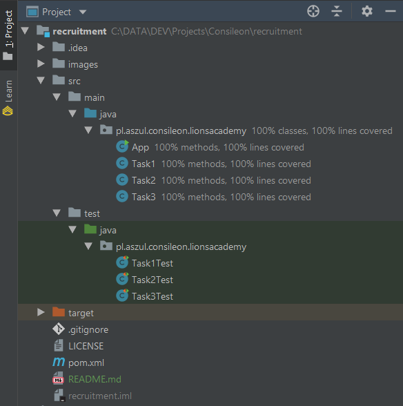
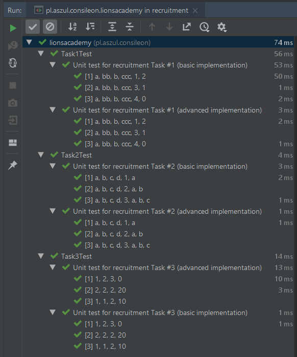
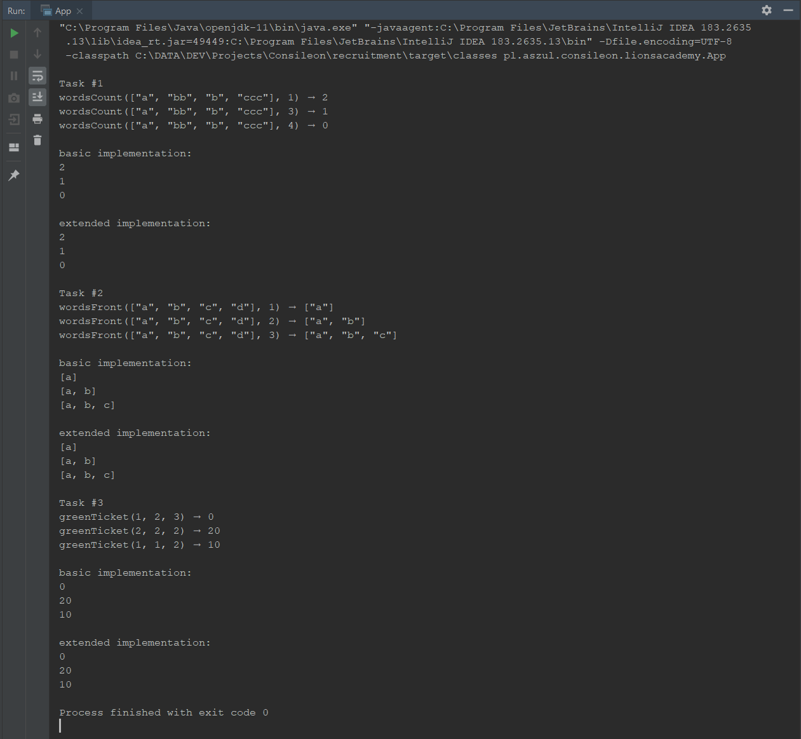

# [Consileon Lions Academy 2018](http://bit.ly/LionsAcademy2018)

This repository contains my implementation of three test tasks that are part of Consileon Lions Academy 2018 recruitment process.

## [Task #1](https://codingbat.com/prob/p124620)

    /**
     * https://codingbat.com/prob/p124620
     * 

     * Given an array of strings, return the count of the number of strings with the given length.
     * 

     * wordsCount(["a", "bb", "b", "ccc"], 1) → 2
     * wordsCount(["a", "bb", "b", "ccc"], 3) → 1
     * wordsCount(["a", "bb", "b", "ccc"], 4) → 0
     *
     * @param words array of words which have to be analyzed
     * @param len   length of words to be counted
     * @return number of words with specified length
     */

## [Task #2](https://codingbat.com/prob/p183837)
    /**
      * https://codingbat.com/prob/p183837
      * 

      * Given an array of strings, return a new array containing the first N strings. N will be in the range 1..length.
      * 

      * wordsFront(["a", "b", "c", "d"], 1) → ["a"]
      * wordsFront(["a", "b", "c", "d"], 2) → ["a", "b"]
      * wordsFront(["a", "b", "c", "d"], 3) → ["a", "b", "c"]
      *
      * @param words array of strings to copy from
      * @param n     length of expected result array
      * @return new arrays of string with specified length
      */

## [Task #3](https://codingbat.com/prob/p120633)
      /**
       * https://codingbat.com/prob/p120633
       * 

       * You have a green lottery ticket, with ints a, b, and c on it. If the numbers are all different from each other,
       * the result is 0. If all of the numbers are the same, the result is 20. If two of the numbers are the same,
       * the result is 10.
       * 

       * greenTicket(1, 2, 3) → 0
       * greenTicket(2, 2, 2) → 20
       * greenTicket(1, 1, 2) → 10
       *
       * @param a first number
       * @param b second number
       * @param c third number
       * @return 0 if all numbers are uniq, 20 if all the same and 10 if two of them are equal
       */

## Project structure

## Basic vs. Extended implementation

For every task I prepared two implementations:
- first one, basic, makes use of basic functionality of Java language.
It is most computational efficient, but
takes more lines of code.

- second, extended implementation uses most cutting edge features of Java language. It is clean, compact, elegant and sophisticated;) So I would recommend this version.

## Unit tests

All methods are covered by [unit tests](src/test/java/pl/aszul/consileon/lionsacademy/) based on latest, 5th version of JUnit:

## Technological stack:
- Java 11 (OpenJDK 11, no licensing/support fee for Oracle),
- Maven,
- JUnit 5 (for unit tests).

## Coding style
 Default IntelliJ code formatter with addition of one recent IntelliJ formatting option - one blank line at the end of class definition ([IDEA-57898](https://youtrack.jetbrains.com/issue/IDEA-57898)), which in my opinion improves code readability.

## Project demo app:

